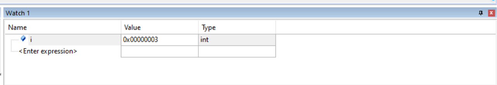

# 8.12作业说明

经过很长时间的努力最终完成了今天的作业。今天主要学习软件的使用，包括cubemx新建工程，keil代码调试。操作流程大体掌握，设置配置的具体细节并不明白。

上图是通过watch窗口更改变量值，在调试停止运行时点击value栏就可以修改，改完运行就可以生效，不需要重新编译烧录。

这张图展示了EventCoder的任务时间统计，eventA是对整个任务进程的时间统计。8+1代表已经完成了8次。

| 字段           | 含义                         |
| --- | --- |
| **T(tot)**   | 该任务从第一次开始到最后一次结束的总耗时（累计时间）|
| **T(avg)**   | 每次执行的平均耗时 = T(tot) / 执行次数  |
| **T(min)**   | 所有执行中最短的一次耗时 |
| **T(max)**   | 所有执行中最长的一次耗时|
| **T(first)** | 第一次执行的起始时间（相对于系统启动） |
| **T(last)**  | 最后一次执行的结束时间  |

| 显示值    | 含义             | 来源        |
| ---------- | ---------- | ------------- |
| **EvStat** | **Event Statistics（事件统计）** | 由 `EventStartX(n)` / `EventStopX(n)` 宏触发，表示**用户自定义的事件记录**   |
| **STDIO**  | **标准输入输出事件**               | 来自 `printf()`、`puts()` 等标准输出函数，或 `EventRecord()` 手动记录的字符串事件 |

右下角的debug（printf）输出buzzer的输出信息。

## 补充

以上提到的三个窗口不可以在同时运行时肆意拖动，不然会发生抽象的错误。